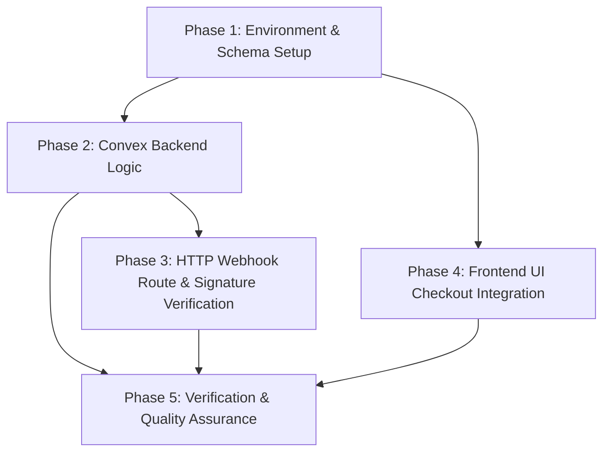

# Tasks Plan: Vandly Payment Integration

Phased execution plan for Vandly payment integration. Tasks are grouped into logical phases designed to allow sequential execution and parallel subagent handoffs.

---

## Task Dependencies & Execution Flow

- **Sequential Prerequisite**: Phase 1 MUST be completed first.
- **Parallel Track A**: Phase 2 -> Phase 3 (Backend & Webhook logic)
- **Parallel Track B**: Phase 4 (Frontend UI Integration) - can run concurrently once Phase 1 schema & environment contracts are ready.
- **Final Consolidation**: Phase 5 (Typecheck, Linting, Codegen).

---

## Phase 1: Environment & Data Model Foundation

- [x] **Task 1.1** `[Phase 1]` Update `.env.example` to document required Vandly environment variables (`VANDLY_WEBHOOK_SECRET`, `VANDLY_PRODUCT_ID`, `NEXT_PUBLIC_VANDLY_CHECKOUT_URL`).
- [x] **Task 1.2** `[Phase 1]` Modify `convex/schema.ts` to add optional Vandly tracking fields (`vandlySubscriptionId`, `vandlySubscriptionStatus`, `vandlyLastEventAt`) and the `by_vandly_subscription_id` index to the `users` table.
- [x] **Task 1.3** `[Phase 1]` Execute `pnpm run convex:gen` to generate updated Convex API definitions and TypeScript schema bindings.

---

## Phase 2: Convex Backend Mutations & Logic

- [x] **Task 2.1** `[Phase 2]` Create the internal mutation `updateSubscriptionFromVandly` in `convex/private/users.ts` (or `convex/users.ts` / `convex/billing/sync.ts`) using the `private` setup convention for backend calls.
- [x] **Task 2.2** `[Phase 2]` Implement dual-provider entitlement calculation in the mutation: preserve `plan = "pro"` if either `polarSubscriptionStatus === "active"` OR `vandlySubscriptionStatus === "active"`; otherwise set `plan = "hobby"`.
- [x] **Task 2.3** `[Phase 2]` Implement timestamp-based out-of-order guard in the mutation by comparing `args.eventTimestamp` against `user.vandlyLastEventAt` to prevent obsolete webhooks from overwriting newer user states.

---

## Phase 3: Convex Webhook HTTP Endpoint & Security

- [x] **Task 3.1** `[Phase 3]` Implement `verifyVandlySignature` helper using Node.js `crypto` (`crypto.createHmac('sha256', secret)`) to validate the `X-Vandly-Signature` header (`sha256=<hex>`) against the raw request body text.
- [x] **Task 3.2** `[Phase 3]` Add the `POST /vandly-webhook` HTTP route in `convex/http.ts` to validate missing webhook secret (`500`), check signatures (`400`), filter events by `productId === VANDLY_PRODUCT_ID` (`200`), extract event timestamps, and invoke the internal `updateSubscriptionFromVandly` mutation.

---

## Phase 4: Frontend UI Checkout Integration

- [x] **Task 4.1** `[Phase 4]` Update Upgrade page (`app/(authed)/upgrade/page.tsx`) to display co-existing subscription options for both Vandly and Polar, prefilling customer email in the Vandly checkout link URL (`NEXT_PUBLIC_VANDLY_CHECKOUT_URL`).
- [x] **Task 4.2** `[Phase 4]` Update Billing page (`app/(authed)/dashboard/billing/page.tsx`) to surface current Vandly subscription status (`active`/`canceled`), active payment provider details, and upgrade/manage options.

---

## Phase 5: Verification & Quality Assurance

- [x] **Task 5.1** `[Phase 5]` Run `pnpm run convex:gen` to verify all Convex code generation is clean and up to date.
- [x] **Task 5.2** `[Phase 5]` Run `pnpm run lint` to enforce ESLint standards and fix any formatting or linting errors across modified files.
- [x] **Task 5.3** `[Phase 5]` Run `pnpm run typecheck` to ensure full TypeScript type safety with zero `as any` casting.
